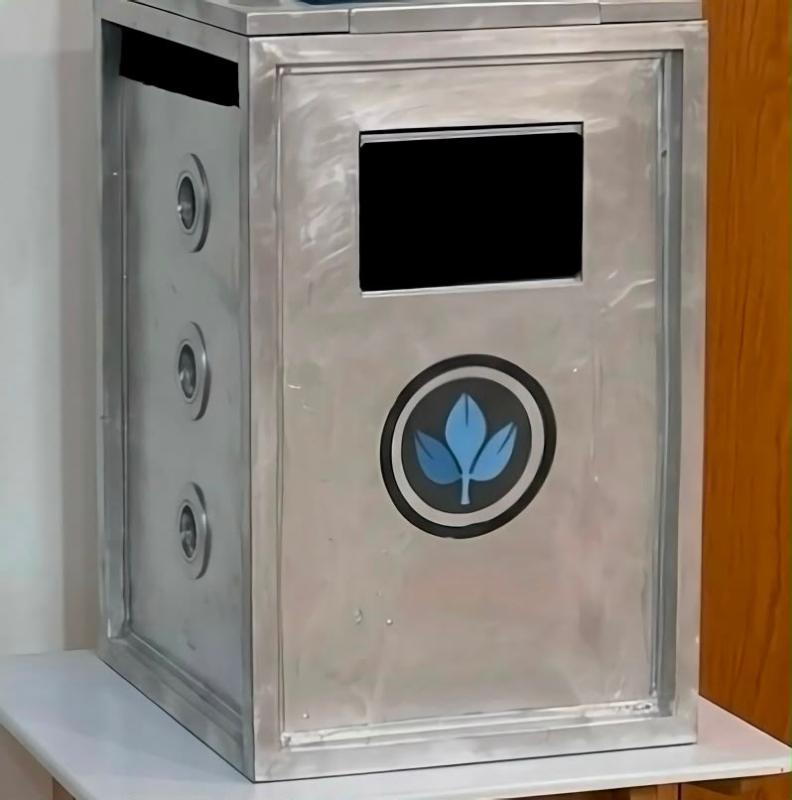

# Aykah · آيكة

**A sustainable, IoT-powered smart waste management system**

  

<em>The Aykah prototype.</em>

## Overview

Aykah is a research and innovation project on how emerging technologies can address real environmental problems through intelligent waste management.

The system combines IoT sensing, real-time monitoring, an interactive LCD interface, LED indicators, air filtration and solar-powered operation in an affordable smart bin. It is designed to encourage responsible waste disposal while making collection more efficient.

Aykah began as a scientific research project. It reflects my interest in applying sustainable technologies to practical, scalable solutions aligned with Saudi Vision 2030 and the United Nations Sustainable Development Goals (SDGs).

## Highlights

- Green, cost-effective technologies at the core of the design
- Community study with **222 participants**
- Focus on sustainability and smart cities
- Young Researchers Award (Modern Technologies) at UNCCD COP16
- Intellectual property procedures in progress

## System

| Component | Role |
| --- | --- |
| Raspberry Pi | Controller for sensing, display and status logic |
| Ultrasonic sensor | Distance sensing for real-time monitoring |
| LCD interface | Shows information to the user |
| LED status indicators | Signal the bin's state at a glance |
| Solar panel | Powers the system for autonomous operation |
| Air filtration | Filters the air around the bin |

## Development

1. **Concept design.** A conceptual study of how intelligent technologies could improve waste management while staying affordable and sustainable.
2. **Digital design.** The concept grew into a complete system design integrating sensing, renewable energy and user interaction.
3. **Prototype construction.** The first physical build validated the structure before any electronics were added.
4. **Electronics integration.** The controller, sensor, display, indicators, solar panel and air filtration were added in stages.
5. **Final prototype.** The completed bin brings the structure and the electronics together as one working system.

## Research methodology

The project combines qualitative and quantitative methods:

- Literature review
- Prototype development
- User-centred design
- Community surveys
- Prototype evaluation
- Data analysis

A public survey of **222 participants** evaluated waste disposal behaviour, environmental awareness and public acceptance of smart waste technologies.

## Impact

Aykah was developed to show how emerging technologies can improve urban sustainability through affordable, intelligent waste management. It contributes to:

- **SDG 11:** Sustainable Cities and Communities
- **SDG 12:** Responsible Consumption and Production
- **SDG 13:** Climate Action

## Recognition

- **Young Researchers Award, Modern Technologies**, United Nations Convention to Combat Desertification (UNCCD) COP16, 2024
- Featured in the [Saudi Gazette](https://saudigazette.com.sa/article/664214/saudi-arabia/how-curiosity-led-a-saudi-teenager-to-develop-a-un-award-winning-smart-waste-management-solution)

## Citation

If you reference this work, please cite:

> Almaktoum, N. F. (2025). *Next-Gen Waste Management: A Novel Approach of Sustainable Cost-Effective Technological Innovations in Smart Bins.*

Citation metadata is in [`CITATION.cff`](CITATION.cff).

## Author

**Nelly F. Almaktoum**, Saudi researcher and innovator
[GitHub](https://github.com/nelmkt) · [LinkedIn](https://www.linkedin.com/in/nelmkt/) · [ORCID](https://orcid.org/0009-0007-9887-0280)

## Licence

© 2025 Nelly F. Almaktoum. All rights reserved.
